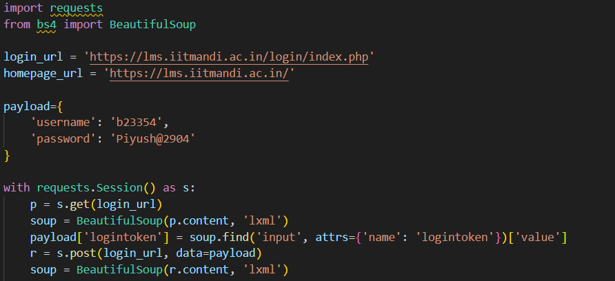

I. Web Scraping:
This question was an entirely new experience for me. I had never done any web scraping whatsoever before so I started by watching some videos on it and here are the resources I used to learn how to do it: -  - [youtube video link]('https://youtu.be/cV21EOf5bbA?si=8dy5Y0j-wD-vfD1B') -  - [youtube video link]('https://youtu.be/XVv6mJpFOb0?si=QY3se2zqKmADyTMR')

            After watching these videos I was able to understand the basics of web scraping and I was able to use the python library BeautifulSoup to scrape the website. Now came the practical part of the challenge. I had to login to the website first and then scrape the data.
    I divided this task into 3 parts:
            1. Login to the website
            2. Get the list of courses fron the site
            3. Get the list of all assignments and their due dates from the site
        1. LOGIN to the site:
            I used the requests library to login to the site. I used the post method to send the login credentials to the site and then I used the get method to get the response from the site. Here is the code snippet for the same:
                    
            I got the following response from the code above:
                    
            I was able to login to the site successfully.
            I was happy.
        2. Get the list of courses fron the site:
            I got on the site on chrome and inspected the page. I found that that the courses where listed deep inside the html code. I found that the course links for each individual course were listed in the html code as shown below:
                    
            I used the find_all method of the BeautifulSoup library to get all the links and then I used the get method to get the href attribute of each link. I stored all the links in a list and then I used the requests library to get the response from each link. I used the get method to get the response from each link. Here is the code snippet for the same:
